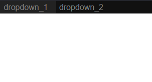

# ds_menubar
A dynamic menu bar that is based on a JSON object. This is useful for creating a menubar quickly and easily without spending hours coding HTML and css, but only spending a few minutes writing your JSON.
[demo](https://kachbit.github.io/ds_menubar/demo/main.html)
## setup
* In your HTML, include the JS and CSS files:
```html
  <link rel="stylesheet" href="../build/menu.css">
  <script src="../build/menu.js"></script>
```
* Create your JSON object for the menubar using this syntax:
```javascript
var json = {
  "name of first dropdown": {
    "content": "dropdown_1 ", // custom function name goes in:  
    subMenu:false
  },
  "name of second dropdown": {
    "content": "dropdown_2",
    submenu:false
  }
}
```
* Create the menu by calling the function:
```javascript
// new Menu(jsonObject, container); <-- return value is the HTML element
var menu = new Menu(tree, document.body);
```
* Create a JS file containing all menu click functions:
```javascript
function optionalFunctionNameHere() {
  console.log('first dropdown was clicked')
}
function dropdown_2() {
  console.log('second dropdown was clicked')
}
```
* Include this JS file inside your HTML head tag:
```html
<script src="./funcs.js"></script>
```
* Put it all together:
```html
<!-- index.html -->
<!DOCTYPE html>
<html>
<head>
  <link rel="stylesheet" href="../build/menu.css">
  <script src="../build/menu.js"></script>
  <!-- remember to include js file containing menu functions  -->
  <script src="./funcs.js"></script>
</head>

<body>
  <script>
    var json = {
      "name of first dropdown": {
        "content": "dropdown_1 ", custom function name goes in: 
        subMenu:false
      },
      "name of second dropdown": {
        "content": "dropdown_2",
        submenu:false
      }
    }
    var menu = new Menu(json, document.body);
  </script>
</body>
</html>
```
## output



### todo
* make menu functions support content with spaces and special characters
* minify /build/menu.js
* custumizable css
